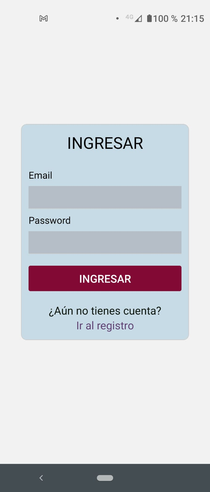
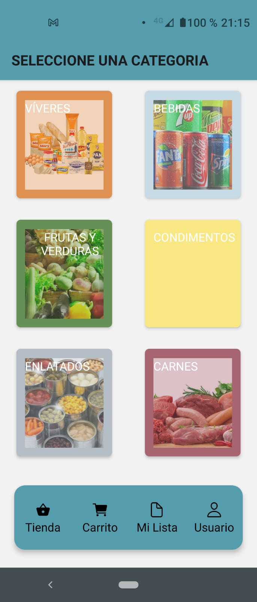
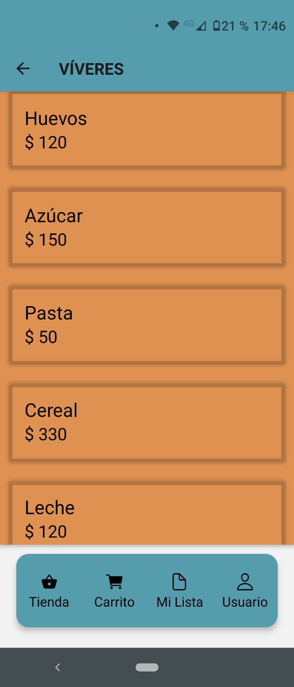
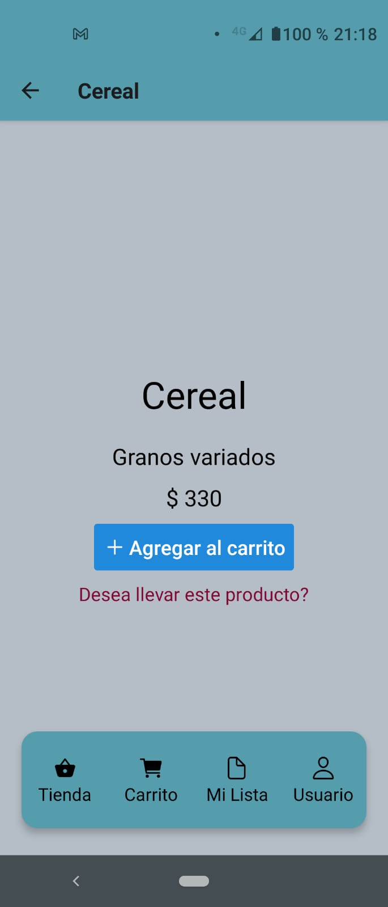
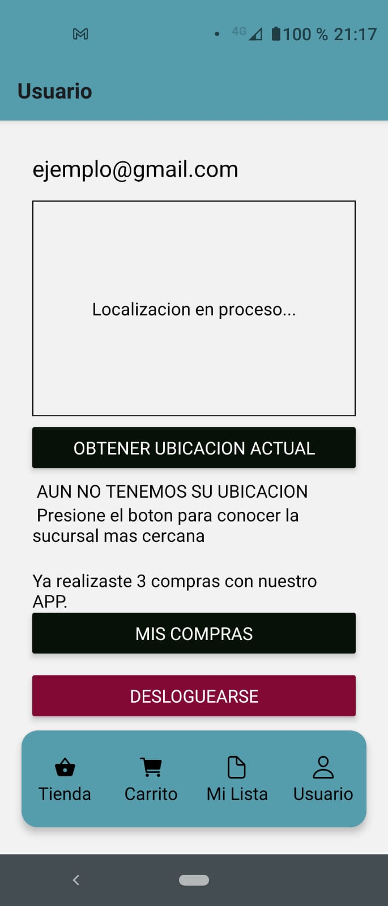
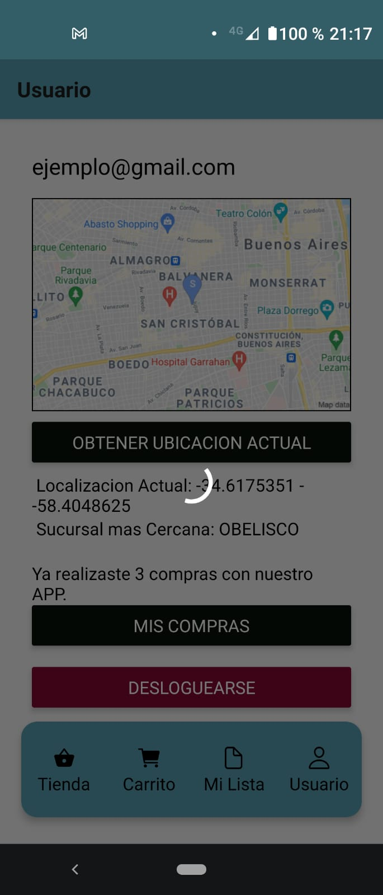
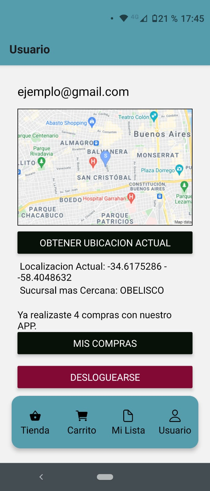

# SuperMelico 🛒

Aplicación diseñada en React Native + Expo + Sqlite + Firebase + Google Auth
H<sub>2</sub>O
Version Productiva en : https://expo.io/artifacts/5d2faaa8-2cc8-4c80-93c1-da7c051129b9

- [x] Lista de Compras
- [X] Carrito en Linea (Firebase)
- [X] Validacion de Usuario mediante Firebase
- [X] Estado General
- [X] Base de Datos de compras
- [ ] Base de Datos de producto
- [ ] Guardar Sesion de Usuario

Trabajo realizado durante un curso.[^coder] .

[^coder]: Curso de Desarrollo de aplicaciones en Coderhouse.


## Galeria
<p align="center">



</p>
<p align="center">



</p>
<p align="center">



</p>

## Porque React?
* Libreria es una coleccion de procesos almacenados(Codigo), que aceleran tu flujo de trabajo.
+ React esta orientada a componentes y esta ideado para desarrollar facilmente interfaces.
- Sus Componentes tienen funcionalidad y estado(sus propios datos), lo cual brinda gran flexibilidad.
+ Rendimiento y Velocidad al utilizar la virtual DOM para mostrar los cambios.
- React es como una navaja suiza para crear interfaces

## Tecnologia utilizada
<p align="center">

    
    
   
     
</p>

# Arquitectura

## Componentes

AddItem.js
Componente que contiene un imput y un boton agregar, se le pasa el comportamiento necesario para agregar un componente a la lista.

Modal.js
Componente que maneja los distintos Modals de la Lista de compras.

./Auth:
AuthScreenWrapper.js
Input.js
Impute s el formulario y AuthScreenWrapper es el componente que brinda la pantalla .

./Cart:
cartItem.js

./Grid:
GridItem.js
ProductGrid.js
Correspondiente a Grilla de Categoria y Grilla de Productos, consumidos de los datos de la carpeta DATA.

./List:
List.js
Componente que contiene toda la lista de Compras.

ListItem.js
Componente que define la cantidad a comprar.

./Profile:
LocationSelector.js
MapPreview.js
Componentes de Location

## Data - Datos de la aplicacion en formato JSON

### Categorias

```json
    {
      id: '1',
      name: 'VÍVERES',
      color: COLORS.PERSIAN,
      pic: "https://angelicasmarket.com/wp-content/uploads/2020/09/COMBO-VIVERES-1.jpg"
    },
```
### Productos

```json
    {
      id: '1',
      category: '1',
      name: 'Huevos',
      description: 'Huevos Naturales y Organicos',
      weight: 450,
      price: 120,
    },
```

## Constantes:

./constant

colors.js
Paleta de colores utilizada en la aplicación.[^color] .

[^color]: Paleta Coolors https://coolors.co/364652-071108-b5bec6-c7dbe6-659157

database.js
claves de API para acceder a los distintos servicios (FIREBASE, GOOGLE AUTH, GOOGLE MAPS)


## Database (Carpeta db y models)

En archivo js, todos los metodos para el CRUD de la base de datos.
El store se comunica desde orders.reducer.js .

En Models estan las Clases que seran equivalentes a las tablas de la base.

## Navigation
El index principal index.js tiene la siguiente estructura, la cual depende de estar logueado o no :

    <NavigationContainer>
      {userId
        ? <TabNavigator />
        : <AuthNavigator />}
    </NavigationContainer>

Authnavigator es un Snack compuesto por 2 pantallas Login y Register.

Tab Navigator son 4 Tabs, donde 3 de ellas son Stacks y la ultima una pantalla (ListScreen)

En Orden:
ProductNavigator
CartNavigator
ListScreen

| Tab 1      | Tab 2 | Tab 3      | Tab 4 |
| ----------- | ----------- | ----------- | ----------- |
| Tienda   | Carrito        | Mi Lista   | Usuario        |
| Stack Product   | Stack Cart        | ListScreen   | Stack Auth        |

