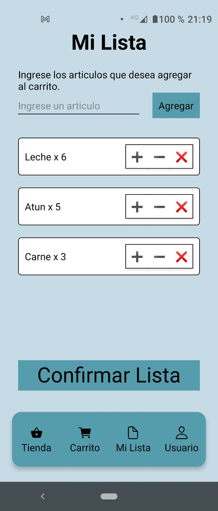

#### SuperMelico

Aplicación diseñada en React Native + Expo + Sqlite + Firebase + Google Auth
Version Productiva en : https://expo.io/artifacts/5d2faaa8-2cc8-4c80-93c1-da7c051129b9

Autenticacion con Firebase + Menu + Lista + Storage + DB + Context

# Componentes:

AddItem.js
Componente que contiene un imput y un boton agregar, se le pasa el comportamiento necesario para agregar un componente a la lista.

Modal.js
Componente que maneja los distintos Modals de la Lista de compras.

./Auth:
AuthScreenWrapper.js
Input.js
Impute s el formulario y AuthScreenWrapper es el componente que brinda la pantalla .

./Cart:
cartItem.js

./Grid:
GridItem.js
ProductGrid.js
Correspondiente a Grilla de Categoria y Grilla de Productos, consumidos de los datos de la carpeta DATA.

./List:
List.js
Componente que contiene toda la lista de Compras.

ListItem.js
Componente que define la cantidad a comprar.

./Profile:
LocationSelector.js
MapPreview.js
Componentes de Location

# Constantes:

./constant

colors.js
Paleta de colores utilizada en la aplicación.
https://coolors.co/364652-071108-b5bec6-c7dbe6-659157

database.js
claves de API para acceder a los distintos servicios (FIREBASE, GOOGLE AUTH, GOOGLE MAPS)

# Database (Carpeta db y models)

En archivo js, todos los metodos para el CRUD de la base de datos.
El store se comunica desde orders.reducer.js .

En Models estan las Clases que seran equivalentes a las tablas de la base.

# Navigation
El index principal index.js tiene la siguiente estructura, la cual depende de estar logueado o no :

    <NavigationContainer>
      {userId
        ? <TabNavigator />
        : <AuthNavigator />}
    </NavigationContainer>

Authnavigator es un Snack compuesto por 2 pantallas Login y Register.

Tab Navigator son 4 Tabs, donde 3 de ellas son Stacks y la ultima una pantalla (ListScreen)

En Orden:
ProductNavigator
CartNavigator
ListScreen

